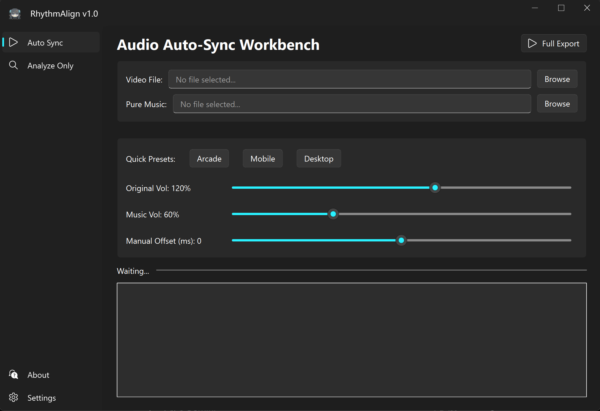

<p align="center">
  <a href="README.md"><b>English</b></a> &nbsp;|&nbsp; <a href="README_zh.md">简体中文</a>
</p>

<p align="center">
  
</p>

<h1 align="center">RhythmAlign</h1>

<p align="center">
  Automated audio alignment tool for rhythm game handcam videos.
</p>

<p align="center">
  
  
  
  
</p>

<p align="center">
  
</p>

---

## Why RhythmAlign?

If you make rhythm game handcam content, you know the routine: you have a video recorded on your phone, and a separate high-quality music file. You need to replace the scratchy onboard audio with the clean track, perfectly synced. Doing this in a video editor means dragging waveforms by eye, rendering, checking, and re-adjusting — over and over. When the recording is from a noisy arcade or a phone mic pressed against a table, the waveform view is barely readable.

RhythmAlign automates the entire process:

1. Pick your video and your music file.
2. The tool extracts both audio tracks, computes the sync offset in musical-feature space, and applies it.
3. You get a new MP4 — video stream untouched (stream-copied), audio replaced with the synced mix.

It handles edge cases that break naive ffmpeg pipelines: variable frame rate (VFR) drift from phone videos, QuickTime edit-list metadata from iPhone MOV containers, and videos with no audio track at all.

---

## How It Works

RhythmAlign doesn't cross-correlate raw waveforms — that would fail as soon as the onboard mic and the studio track have different timbre or noise profiles. Instead it operates on features that are invariant to recording quality.

### Strategy 1 — Chroma (Pitch Matching)

```python
feat_video = librosa.feature.chroma_cens(y=y_video, sr=sr, hop_length=512)
feat_music = librosa.feature.chroma_cens(y=y_music, sr=sr, hop_length=512)
```

Chroma CENS maps audio to a 12-bin pitch-class vector per time frame, then smooths and normalizes across time. The result captures *which notes are playing* regardless of *how they were recorded*. Each of the 12 chroma bands is cross-correlated independently and summed:

```python
for i in range(12):
    correlation += signal.correlate(feat_music[i], feat_video[i], mode='full', method='fft')
```

The peak position in the summed correlation gives the offset. This works reliably for clean recordings — desktop screen capture, line-in from a capture card.

### Strategy 2 — Onset (Rhythm Matching, Automatic Fallback)

```python
onset_video = librosa.onset.onset_strength(y=y_video, sr=sr, hop_length=512)
onset_music = librosa.onset.onset_strength(y=y_music, sr=sr, hop_length=512)
```

When Chroma fails the confidence check — typical for noisy phone recordings — the algorithm switches to Onset Strength. This tracks note attack transients: *when* notes hit, not *what* they are. It's a 1D signal per track, far more robust against ambient noise and clipping. Lower precision than Chroma, but it gets the job done where Chroma can't.

### Confidence Check

After computing the correlation, the algorithm measures the peak's Z-score:

```python
z_score = (max(correlation) - mean(correlation)) / std(correlation)
```

If Z-score < 2.0, the result is flagged as unreliable. If both strategies fail, the UI reports the error explicitly — it never silently exports a misaligned video.

---

## Features

**Audio alignment**
- Dual-strategy engine: Chroma → Onset automatic fallback
- Z-score confidence gate with explicit error reporting on failure
- Manual offset slider (±500 ms) for edge cases

**Video export**
- Stream copy (default): zero re-encode, zero quality loss, seconds to finish
- Re-encode mode: NVIDIA NVENC with 6000k / 10000k / 20000k presets
- Three one-tap volume presets: Arcade, Mobile, Desktop

**Mobile video hardening**

| Problem | Fix applied |
|---|---|
| VFR timestamps cause A/V drift over time | `-fflags +genpts` regenerates uniform PTS |
| Negative timestamps break player sync | `-avoid_negative_ts make_zero` |
| QuickTime edit-list atoms corrupt the muxer | `-map_metadata -1` strips proprietary metadata |
| moov atom at end blocks progressive streaming | `-movflags +faststart` |

**Additional tools**
- **Analyze-only mode:** compute the offset without exporting — paste the number into any editor timeline
- **`diagnose_offset.py`:** CLI tool that prints Chroma variance, Z-score, audio stream metadata, and specific troubleshooting advice per metric
- **Bilingual UI:** English / 简体中文, JSON-based i18n, no framework overhead

---

## Quick Start

**Requirements:** Windows 10/11, Python 3.9+ (64-bit). FFmpeg is bundled via `imageio-ffmpeg`.

```bash
git clone https://github.com/Daozhu1007/RhythmAlign.git
cd RhythmAlign
python -m venv .venv
.venv\Scripts\activate
pip install -r requirements.txt
python ui_main.py
```

Troubleshoot a difficult file pair:

```bash
python diagnose_offset.py "video.mp4" "music.mp3"
```

---

## Usage

### Auto Sync

1. Select your video file (MP4, MKV, MOV, AVI, FLV, WMV, WebM, TS).
2. Select your reference music file (MP3, WAV, FLAC, M4A, AAC, OGG, WMA).
3. Pick a volume preset or adjust sliders manually.
4. Click **Full Export** and choose an output path.

### Analyze Only

Same input selection, but instead of exporting, you get the offset value displayed in large text — e.g. `+0.1234 s` or `-0.5678 s` — with an instruction for which direction to nudge the music track in your editor.

### Settings

| Setting | Default | What it does |
|---|---|---|
| Language | 简体中文 | UI language (requires restart) |
| Stream Copy | On | Skip video re-encode for instant export |
| GPU Acceleration | Off | NVIDIA NVENC when transcoding |
| Bitrate | 10000k | 6000k / 10000k / 20000k |
| Open Output Folder | On | Auto-open after export |

Settings persist to `config.json`.

---

## Project Structure

```
RhythmAlign/
├── ui_main.py              # GUI: Sync, Analyze, Settings, About tabs
├── auto_sync.py            # Alignment engine + ffmpeg export pipeline
├── diagnose_offset.py      # CLI diagnostic tool
├── assets/
│   ├── logo.png / logo.ico # App icons
│   ├── github.png          # GitHub link icon
│   └── bilibili.png        # Bilibili link icon
├── locales/
│   ├── zh_CN.json
│   └── en_US.json
├── requirements.txt
├── config.json             # User settings (auto-generated)
├── RhythmAlign.spec        # PyInstaller spec
└── RhythmAlign.iss         # Inno Setup installer script
```

---

## Copyright & Disclaimer

### App Icon

The app icon is cropped from the **"Tairitsu Duck" (对立鸭)** emoji sticker series, created by **春也Haruya** ([Bilibili UID: 3280](https://space.bilibili.com/3280)). Used under a free open-source license granted by the original commissioner.

### IP Notice

**Tairitsu (对立)** and all related character designs and intellectual property are owned by **lowiro**. RhythmAlign is an independent, non-commercial community tool — not affiliated with or endorsed by lowiro.

---

## License & Commercial Use

This project is distributed under the **[PolyForm Noncommercial License 1.0.0](LICENSE)**.

**Personal Use is completely FREE.** You are welcome to use this tool for your personal rhythm game handcam videos.

**Commercial Use is STRICTLY PROHIBITED** under this license. This includes using this tool for commissioned video editing, monetized studio productions, or redistributing the software for profit.

**For commercial licensing and inquiries, please contact the author to purchase a Commercial License.**

---

<p align="center">
  <a href="https://github.com/Daozhu1007/RhythmAlign"></a>
  &nbsp;
  <a href="https://space.bilibili.com/477852567"></a>
</p>
