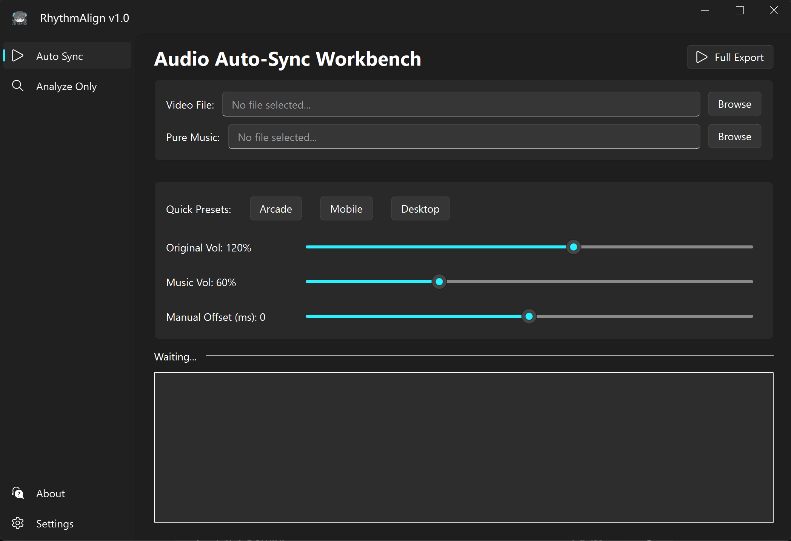

<p align="center">
  <a href="README.md"><b>English</b></a> &nbsp;|&nbsp; <a href="README_zh.md">简体中文</a>
</p>

<p align="center">
  
</p>

<h1 align="center">RhythmAlign</h1>

<p align="center">
  Automatic audio alignment for rhythm game handcam videos.
</p>

<p align="center">
  
  
  
  
</p>

<p align="center">
  
</p>

---

## Overview

RhythmAlign is built for one painful editing task: replacing noisy handcam audio with a clean music track while keeping the timing locked to the original video.

Instead of dragging waveforms by eye, you select:

1. the handcam video,
2. the clean reference music,
3. an output path.

RhythmAlign extracts both audio tracks, estimates the offset in musical-feature space, and exports a new MP4. By default it stream-copies the video track, so the image quality is preserved and only the audio is rebuilt.

## Download

For regular use, download the latest Windows build from [GitHub Releases](https://github.com/Daozhu1007/RhythmAlign/releases).

- **Setup installer:** recommended for normal installation, Start menu shortcuts, and stable Windows taskbar identity.
- **Portable ZIP:** unzip anywhere and run `RhythmAlign.exe` directly.

This README describes the current app. Per-version change logs are kept in the Release Notes so the front page stays readable.

## Current Highlights

- Light/dark UI with optional Windows theme following.
- Drag-and-drop video and audio import on both sync and analysis pages.
- Multi-evidence alignment engine: substantially more robust on difficult, quiet, or noisy handcam recordings, and able to refuse to guess when the evidence is unreliable.
- Video stream copy by default, preserving image quality while rebuilding audio.
- Analyze-only mode, diagnostic reports, and built-in update checks for easier troubleshooting.

## How Alignment Works

Raw waveform correlation is fragile. A phone microphone, arcade cabinet speakers, hand taps, compression, clipping, and background noise can make the recorded waveform look nothing like the clean music file.

RhythmAlign v1.2.0 aligns by combining several independent kinds of musical evidence instead of trusting any single one:

1. **Decode to analysis audio**

   FFmpeg extracts both inputs to mono PCM at the analysis sample rate.

2. **Gather several independent kinds of evidence**

   The engine examines the recording through complementary lenses — melodic movement, rhythmic onsets, and noise-robust spectral texture. Each lens produces its own candidate placements; no single lens decides alone.

3. **Cross-check the candidates**

   A placement is only accepted when independent kinds of evidence agree on the same offset. Brief one-off matches (a single tap, a sound effect) cannot pass on their own: the engine checks that the matching evidence is spread across the song, not concentrated in a single moment.

4. **Refuse to guess when unsure**

   If the evidence is too weak, too ambiguous (several similarly plausible placements), or too concentrated, RhythmAlign stops with a clear explanation instead of exporting a confidently wrong result.

5. **Export safely**

   FFmpeg delays or trims the replacement music, mixes it with the original audio if requested, and writes a new MP4.

Positive offset means the replacement music is delayed. Negative offset means the beginning of the replacement music is trimmed.

## Features

**Alignment**

- Multi-evidence alignment engine with cross-checked candidate placements
- Evidence-gated decisions: the offset is accepted only when independent evidence agrees
- Safe-stop behavior: unreliable, ambiguous, or brief-match cases stop before export instead of producing a wrong video
- Temporal-support check that rejects placements supported by only a short snippet of audio
- Analyze-only mode for checking the offset without exporting
- Manual offset slider for final fine adjustment on top of a successful automatic alignment

**Export**

- Default video stream copy: no video re-encode, no quality loss
- Optional re-encode mode with NVIDIA NVENC support
- AAC audio output at 320 kbps
- Handles videos with no original audio track
- Cleans problematic metadata and timestamps for more reliable MP4 playback

**Workflow**

- One-screen sync workbench
- Drag-and-drop video/audio import
- Quick volume presets for arcade, mobile, and desktop recordings
- Bilingual UI: English and Simplified Chinese
- Light/dark theme support with optional Windows theme following
- Startup/manual update checks through the Settings page, with one-click installer download and SHA256 verification
- Copyable diagnostic report for troubleshooting packaged builds and difficult file pairs
- CLI diagnostic tool for difficult file pairs

## Run from Source

Packaged builds do not require Python. Use these steps when you want to run the source checkout directly or work on the project.

Requirements:

- Windows 10/11
- Python 3.9+ 64-bit
- Dependencies from `requirements.txt`
- FFmpeg is provided through `imageio-ffmpeg`

```powershell
git clone https://github.com/Daozhu1007/RhythmAlign.git
cd RhythmAlign
python -m venv .venv
.venv\Scripts\activate
pip install -r requirements.txt
python ui_main.py
```

Run the test suite:

```powershell
python -m pytest -q
```

## Usage

### Auto Sync

1. Select a video file: MP4, MKV, MOV, AVI, FLV, WMV, WebM, or TS.
2. Select a reference audio file: MP3, WAV, FLAC, M4A, AAC, OGG, or WMA.
3. Choose a volume preset or adjust volumes manually.
4. Click **Full Export** and choose the output path.

After a successful automatic alignment you can fine-tune the result in milliseconds. The manual slider is added on top of the automatic offset — it is a fine adjustment, not a substitute for the automatic alignment.

If RhythmAlign cannot determine the offset reliably, it shows a clear "could not reliably determine" message and does not export — no wrong video is produced. This is a deliberate safety stop, not a crash. Check that the selected music is the track actually playing in the video, and retry with the exact matching source.

For best results, use the exact same music source as the one heard in the video. Different rips, edits, previews, or platform downloads can have intros, fades, mastering differences, or tiny cuts that no fixed-offset aligner can fully correct.

### Analyze Only

Use **Analyze Only** when you want the offset without exporting. This is useful when you plan to do the final edit in another video editor.

Example result:

```text
+0.1234 s
```

That means delaying the replacement music by `0.1234` seconds. If the evidence is unreliable, the analysis shows an explicit "could not reliably determine" state instead of a number.

### Diagnose Difficult Pairs

```powershell
python diagnose_offset.py "video.mp4" "music.mp3"
```

The diagnostic output includes audio duration, RMS/peak levels, Chroma variance, Z-score, independent peak ratio, and the calculated offset.

## Reliability Notes

RhythmAlign v1.2.0 is substantially more robust on difficult recordings — quiet handcams, heavy noise, repeated chart sections — and it now refuses to guess when the evidence does not support any placement. It is still a fixed-offset aligner, not a universal repair tool. It can still struggle when:

- the reference music is not the same version as the video audio,
- the video was cut in the middle,
- the video has speed changes or long-term audio drift,
- noise overpowers the music so thoroughly that little usable evidence remains,
- the song has extremely repetitive harmony and rhythm, which can leave several equally plausible placements,
- the clean track has a different intro, fade, or silence padding.

When RhythmAlign stops instead of exporting, it invents no number and produces no wrong video. Not every stopped case can be recovered inside the app: the manual ±500 ms slider is a fine adjustment on top of a successful automatic alignment, not a full manual placement system.

For these cases, use `diagnose_offset.py`, Analyze Only mode, or a manual offset check before final export.

## Project Layout

```text
RhythmAlign/
├── ui_main.py              # PyQt GUI
├── alignment_engine_v2.py  # Evidence-gated alignment engine (default path)
├── auto_sync.py            # FFmpeg extraction/export pipeline and legacy engine
├── diagnose_offset.py      # CLI diagnostic tool
├── tests/                  # Export and alignment reliability tests
├── assets/                 # App icon and screenshots
├── locales/                # English and Chinese UI strings
├── requirements.txt
├── RhythmAlign.spec        # PyInstaller build config
└── RhythmAlign.iss         # Inno Setup installer script
```

## Build Notes

The repository includes packaging files for PyInstaller and Inno Setup. The maintainer release flow, including installer and portable ZIP creation, is documented in [RELEASE.md](RELEASE.md).

## Copyright and Disclaimer

The app icon is cropped from the "Tairitsu Duck" emoji sticker series, created by Haruya ([Bilibili UID: 3280](https://space.bilibili.com/3280)) and used under a free open-source permission granted by the original commissioner.

Tairitsu and related character IP belong to lowiro. RhythmAlign is an independent, non-commercial community tool and is not affiliated with or endorsed by lowiro.

## License

RhythmAlign is released under the [PolyForm Noncommercial License 1.0.0](LICENSE).

Personal, non-commercial use is free. Commercial use, paid editing services, monetized studio use, and redistribution for profit are prohibited unless separately licensed by the author.

<p align="center">
  <a href="https://github.com/Daozhu1007/RhythmAlign"></a>
  &nbsp;
  <a href="https://space.bilibili.com/477852567"></a>
</p>
