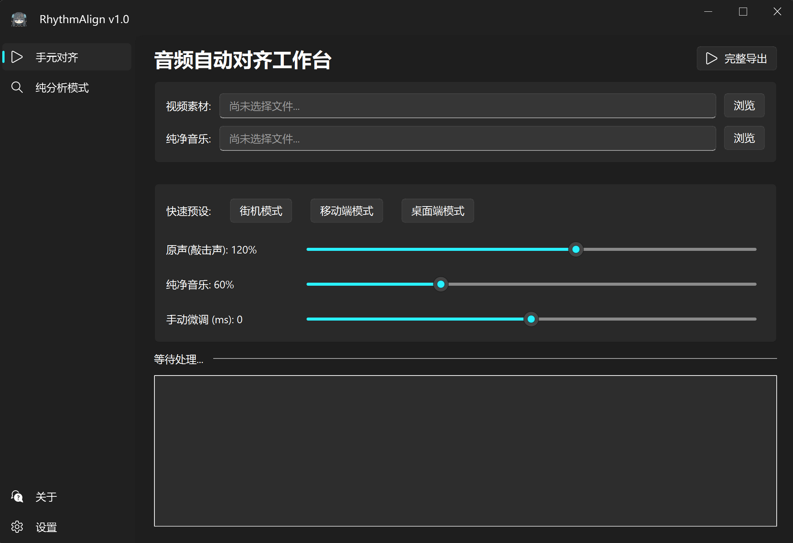

<p align="center">
  <a href="README.md">English</a> &nbsp;|&nbsp; <a href="README_zh.md"><b>简体中文</b></a>
</p>

<p align="center">
  
</p>

<h1 align="center">RhythmAlign</h1>

<p align="center">
  音游手元自动化音频对齐工具，让制作高质量手元更轻松。
</p>

<p align="center">
  
  
  
  
</p>

<p align="center">
  
</p>

---

## 为什么需要 RhythmAlign？

做音游手元的朋友都懂这个流程：手机录了一段手元，手上还有一份高品质的原声音轨。你得把视频里嘈杂的外录音频替换成干净的纯音频，还得完美同步。在剪辑软件里手动操作，就是凭眼睛反复拖波形、渲染、检查、再微调——一遍又一遍。如果是在嘈杂的机厅录的、或是手机贴着桌子收音的，那波形图基本等于废纸，根本没法看。

RhythmAlign 把这整件事自动化了：

1. 选中你的视频和纯音频文件。
2. 工具提取两条音轨，在音乐特征空间中计算同步偏移量，自动应用。
3. 输出一个全新的 MP4——视频流原封不动（流拷贝），音轨替换为已对齐的混音。

它还会自动处理那些让普通 ffmpeg 命令翻车的坑：手机视频的可变帧率漂移、iPhone MOV 的 QuickTime 编辑表元数据、以及根本没有音轨的无声视频。

---

## 工作原理

RhythmAlign 不对原始波形做互相关——机载麦克风和录音室音轨的音色、噪声剖面完全不同，直接做波形相关必挂无疑。它改在「与录音质量无关」的音乐特征空间中操作。

### 策略一：Chroma（旋律匹配）

```python
feat_video = librosa.feature.chroma_cens(y=y_video, sr=sr, hop_length=512)
feat_music = librosa.feature.chroma_cens(y=y_music, sr=sr, hop_length=512)
```

Chroma CENS 将音频映射为每帧 12 维音高类别向量，再做时序平滑与归一化。得到的结果是「哪些音高在响」——完全不关心是怎么录的。对 12 个色度通道分别做互相关，然后求和：

```python
for i in range(12):
    correlation += signal.correlate(feat_music[i], feat_video[i], mode='full', method='fft')
```

相关曲线峰值所在位置即为时间偏移量。这条策略在干净录音下很稳——桌面内录、采集卡线路输入都没问题。

### 策略二：Onset（节拍匹配，自动回退）

```python
onset_video = librosa.onset.onset_strength(y=y_video, sr=sr, hop_length=512)
onset_music = librosa.onset.onset_strength(y=y_music, sr=sr, hop_length=512)
```

当 Chroma 的置信度不达标时——在嘈杂的手机外录中很常见——算法自动切换为 Onset Strength。它追踪的是音符的瞬态起始：音符「何时」敲响，而不是「什么音」在响。一维信号，对噪声和削波极度鲁棒。精度不如 Chroma，但能在 Chroma 搞不定的场景下兜住底。

### 置信度检验

算出相关度曲线后，算法会测量峰值的 Z-score：

```python
z_score = (max(correlation) - mean(correlation)) / std(correlation)
```

Z-score < 2.0 的结果会被标记为不可靠。两条策略都失败时，UI 会直接报错——绝不静默地输出对齐歪了的结果。

---

## 核心特性

**音频对齐**
- 双策略引擎：Chroma → Onset 自动回退
- Z-score 置信门控，失败时明确报错，不暗中导出错位视频
- 手动偏移微调滑块（±500 ms），应对极端情况

**视频导出**
- 流拷贝（默认）：零重编码、零画质损失，几秒内完成封装
- 重编码模式：NVIDIA NVENC 加速，6000k / 10000k / 20000k 三档码率
- 三档一键音量预设：街机 / 手机 / 桌面

**手机视频加固**

| 问题 | 修复方式 |
|---|---|
| VFR 时间戳导致音画逐渐漂移 | `-fflags +genpts` 强制重建统一显示时间戳 |
| 负时间戳导致不同播放器同步不一致 | `-avoid_negative_ts make_zero` |
| QuickTime 编辑表元数据 atom 引发封装器报错 | `-map_metadata -1` 剥离全部私有元数据 |
| moov atom 在文件尾部导致无法边下边播 | `-movflags +faststart` |

**附加工具**
- **纯分析模式：** 只算偏移量不导出——把数值填进任意剪辑软件时间轴即可
- **`diagnose_offset.py`：** 命令行诊断工具，输出 Chroma 方差、Z-score、音轨元数据，并针对每项指标给出具体排查建议
- **中英双语界面：** 简体中文 / English，基于 JSON 的无框架 i18n 引擎

---

## 快速开始

**环境要求：** Windows 10/11，Python 3.9+（64 位）。FFmpeg 由 `imageio-ffmpeg` 自动捆绑提供。

```bash
git clone https://github.com/Daozhu1007/RhythmAlign.git
cd RhythmAlign
python -m venv .venv
.venv\Scripts\activate
pip install -r requirements.txt
python ui_main.py
```

诊断顽固文件对：

```bash
python diagnose_offset.py "video.mp4" "music.mp3"
```

---

## 使用指南

### 自动对齐

1. 选择视频文件（MP4、MKV、MOV、AVI、FLV、WMV、WebM、TS）。
2. 选择参考音频文件（MP3、WAV、FLAC、M4A、AAC、OGG、WMA）。
3. 选择音量预设或手动调整滑块。
4. 点击**完整导出**，选择输出路径。

> **提示：** 为获得最佳对齐效果，请使用与视频中完全相同的音频源文件（如机台原音频）。从 YouTube 等平台下载的音频可能与游戏内版本存在差异，导致对齐偏差数秒。

### 纯分析

同样的输入方式，但不导出文件——结果以大号文字显示偏移量，例如 `+0.1234 s` 或 `-0.5678 s`，附带文字说明在剪辑软件里该往哪个方向拖动纯音乐轨。

### 设置项

| 设置项 | 默认值 | 说明 |
|---|---|---|
| 界面语言 | 简体中文 | 切换语言（需重启） |
| 视频流直拷 | 开 | 跳过视频重编码，近乎瞬时导出 |
| GPU 加速渲染 | 关 | 转码时启用 NVIDIA NVENC |
| 视频码率 | 10000k | 6000k / 10000k / 20000k |
| 完成后打开文件夹 | 开 | 导出后自动打开目标目录 |

设置持久化保存在 `config.json`。

---

## 项目结构

```
RhythmAlign/
├── ui_main.py              # GUI：对齐、分析、设置、关于 四个标签页
├── auto_sync.py            # 对齐引擎 + ffmpeg 导出管线
├── diagnose_offset.py      # 命令行诊断工具
├── assets/
│   ├── logo.png / logo.ico # 应用图标
│   ├── github.png          # GitHub 链接图标
│   └── bilibili.png        # B站 链接图标
├── locales/
│   ├── zh_CN.json
│   └── en_US.json
├── requirements.txt
├── config.json             # 用户设置（程序自动生成）
├── RhythmAlign.spec        # PyInstaller 打包配置
└── RhythmAlign.iss         # Inno Setup 安装包脚本
```

---

## 版权与免责声明

### 应用图标

应用图标裁剪自 **"对立鸭"** 表情包系列，由画师 **春也Haruya**（[B站 UID: 3280](https://space.bilibili.com/3280)）创作。约稿方授予了免费开放使用授权，在此致谢。

### IP 声明

**对立（Tairitsu）** 及相关角色设计、知识产权归 **lowiro** 所有。RhythmAlign 为独立、非商业的社区同人工具，与 lowiro 无关，亦未获其背书。

---

## 协议与商用说明 (License)

本项目采用 **[PolyForm Noncommercial License 1.0.0](LICENSE)** 协议发布。

**个人及非商业性使用完全免费。** 欢迎您使用本工具制作个人的音游手元视频。

**严禁任何未经授权的商业使用！** 包括但不限于：使用本工具接单代做视频、工作室盈利性产出、或将本软件二次打包售卖。如需商用，请务必联系作者购买商业授权。对于任何违规商用行为，作者保留追究法律责任的权利。

---

<p align="center">
  <a href="https://github.com/Daozhu1007/RhythmAlign"></a>
  &nbsp;
  <a href="https://space.bilibili.com/477852567"></a>
</p>
