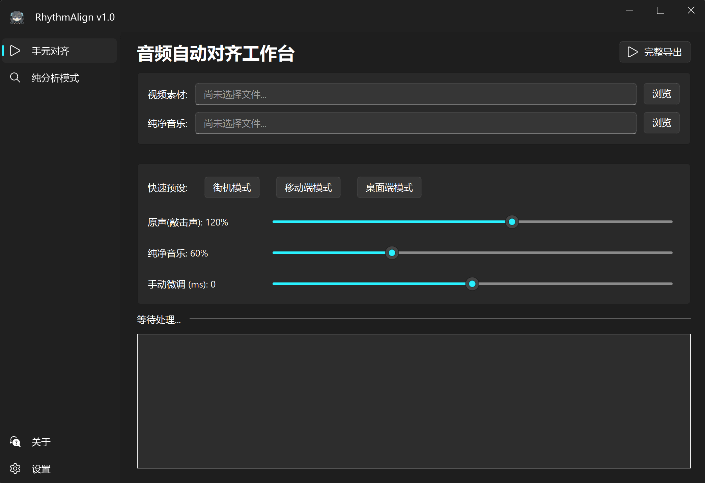

<p align="center">
  <a href="README.md">English</a> &nbsp;|&nbsp; <a href="README_zh.md"><b>简体中文</b></a>
</p>

<p align="center">
  
</p>

<h1 align="center">RhythmAlign</h1>

<p align="center">
  面向音游手元视频的自动音频对齐工具。
</p>

<p align="center">
  
  
  
  
</p>

<p align="center">
  
</p>

---

## 项目简介

RhythmAlign 解决的是音游手元后期里最折磨人的一件事：把手机或相机录到的嘈杂原声，替换成干净的曲目音频，同时保持和画面严格同步。

传统做法是在剪辑软件里盯着波形一点点拖、渲染、检查、再拖。遇到机厅噪声、手部敲击声、手机麦克风压缩、或者桌面共振，波形图经常几乎没有参考价值。

RhythmAlign 把这个流程自动化：

1. 选择手元视频。
2. 选择干净的参考音乐。
3. 选择导出路径。

工具会自动提取两条音轨，在音乐特征空间中计算偏移量，然后导出新的 MP4。默认模式会直接复制原视频流，只重新封装音轨，因此画质不会因为导出而二次损失。

## 下载

日常使用建议从 [GitHub Releases](https://github.com/Daozhu1007/RhythmAlign/releases) 下载最新版 Windows 打包产物。

- **安装版：** 推荐普通用户使用，会创建开始菜单快捷方式，并使用稳定的 Windows 任务栏应用身份。
- **便携版 ZIP：** 解压到任意目录后直接运行 `RhythmAlign.exe`。

README 只保留当前版本的能力说明。每个版本的详细更新记录放在 Release Notes 里，首页会清爽很多。

## 当前亮点

- 支持浅色/深色主题，可跟随 Windows 系统主题。
- 手元对齐和纯分析页面都支持拖拽导入视频与音频。
- 多证据融合对齐引擎：在困难、安静或嘈杂的手元录音下明显更稳，并且在证据不可靠时会拒绝猜测、安全停止。
- 默认直拷视频流，只重建音频，尽量保留原画质。
- 提供纯分析模式、诊断信息复制和内置检查更新，方便排查疑难素材。

## 对齐原理

RhythmAlign 不直接对原始波形做互相关。手机麦克风、机台喇叭、敲击声、削波、压缩和环境噪声都会让录音波形与干净音源差异巨大，直接匹配波形非常容易失败。

v1.2.0 的对齐不再依赖任何单一证据，而是综合多种相互独立的音乐证据：

1. **解码分析音频**

   通过 FFmpeg 将视频音轨和参考音乐解码为统一采样率的单声道 PCM。

2. **收集多种相互独立的证据**

   引擎从多个互补的视角审视录音——旋律走向、节奏起振、抗噪声谱纹理。每个视角各自给出候选偏移，任何单一视角都不能单独拍板。

3. **交叉验证候选结果**

   只有当多种独立证据指向同一个偏移时，结果才会被采纳。一次性的短暂匹配（一声敲击、一个音效）无法独立通过：引擎会检查匹配证据是否分布在整个曲目中，而不是集中在某一瞬间。

4. **证据不足时拒绝猜测**

   如果证据太弱、太模糊（存在多个同样可疑的偏移）或过于集中，RhythmAlign 会明确停下并说明原因，而不是导出一个自信但错误的结果。

5. **安全导出**

   根据偏移量延迟或裁剪替换音乐，并通过 FFmpeg 重新封装为新 MP4。

偏移量为正，表示需要延迟替换音乐；偏移量为负，表示需要裁掉替换音乐开头的一段。

## 功能特性

**音频对齐**

- 多证据融合对齐引擎，候选结果需通过交叉验证
- 证据门控：只有独立证据一致时才采纳偏移结果
- 安全停止：证据不可靠、模糊或仅靠短暂片段支撑时，导出前安全停止，不产出错误视频
- 时间支撑校验，拒绝仅由一小段音频支撑的对齐结果
- 纯分析模式：只计算偏移，不导出视频
- 手动微调滑块，用于成功自动对齐之后的最终细调

**视频导出**

- 默认视频流直拷：不重编码，不损失画质
- 可选重新编码模式，支持 NVIDIA NVENC
- AAC 320 kbps 音频输出
- 支持原视频没有音轨的情况
- 自动处理 VFR 时间戳、负时间戳、QuickTime 私有元数据、moov atom 等常见封装问题

**工作流**

- 一屏式手元对齐工作台
- 支持拖拽导入视频和音频
- 街机、移动端、桌面端三档音量预设
- 简体中文 / English 双语界面
- 支持浅色/深色主题，并可跟随 Windows 系统主题
- 设置页支持启动/手动检查更新，一键下载安装包并进行 SHA256 校验
- 可复制诊断信息，方便排查打包版问题和疑难素材
- 命令行诊断工具，方便分析疑难素材

## 从源码运行

打包版不需要安装 Python。下面的步骤适合想直接运行源码或参与开发时使用。

环境要求：

- Windows 10/11
- Python 3.9+ 64 位
- `requirements.txt` 中的依赖
- FFmpeg 由 `imageio-ffmpeg` 自动提供

```powershell
git clone https://github.com/Daozhu1007/RhythmAlign.git
cd RhythmAlign
python -m venv .venv
.venv\Scripts\activate
pip install -r requirements.txt
python ui_main.py
```

运行测试：

```powershell
python -m pytest -q
```

## 使用方法

### 手元对齐

1. 选择视频文件：MP4、MKV、MOV、AVI、FLV、WMV、WebM、TS。
2. 选择参考音乐：MP3、WAV、FLAC、M4A、AAC、OGG、WMA。
3. 选择音量预设，或手动调整原声与替换音乐音量。
4. 点击 **完整导出**，选择输出路径。

自动对齐成功后，可以按毫秒做最终微调。手动滑块叠加在自动偏移之上——它是细调手段，不能替代自动对齐。

如果 RhythmAlign 无法可靠地确定偏移量，会显示明确的“无法可靠确定”提示，并且不开始导出——不会产出错误视频。这是有意的安全停止，不是报错。请检查所选音乐是否确为视频中播放的曲目，换用完全一致的音源后重试。

为了获得最佳结果，请尽量使用与视频中实际播放内容完全一致的音源。不同平台下载的音频、不同剪辑版本、带前导静音或淡入淡出的版本，都可能导致固定偏移无法完全对齐。

### 纯分析模式

如果只想得到偏移量，不想立刻导出视频，可以使用 **纯分析模式**。这个数值可以手动填入其他剪辑软件。

示例：

```text
+0.1234 秒
```

这表示需要将替换音乐延迟 `0.1234` 秒。如果证据不可靠，分析会显示明确的“无法可靠确定”状态，而不会给出任何数字。

### 诊断疑难素材

```powershell
python diagnose_offset.py "video.mp4" "music.mp3"
```

诊断输出包括音频时长、RMS、峰值、Chroma 方差、Z-score、独立峰值比和计算出的偏移量。

## 可靠性边界

v1.2.0 在困难录音——安静手元、强噪声、重复谱面段落——下明显更稳，并且在证据不支持任何偏移时会拒绝猜测。但它仍是固定偏移对齐工具，不是万能修复器。以下场景仍可能遇到困难：

- 参考音乐和视频中的音源不是同一个版本。
- 视频中途被剪切过。
- 视频存在变速、掉帧、长时间音频漂移。
- 噪声远大于音乐本体，导致可用证据不足。
- 曲目本身和声与节奏都极度重复，可能留下多个同样可疑的偏移。
- 参考音乐开头有不同长度的静音、淡入或额外前奏。

当 RhythmAlign 选择停止而不导出时，它不会编造数字，也不会产出错误视频。并非每个停止的案例都能在应用内补救：±500 ms 手动滑块是成功自动对齐之上的微调手段，不是完整的手动放置系统。

遇到这些情况，建议先用 `diagnose_offset.py` 或纯分析模式确认偏移，再进行最终导出。

## 项目结构

```text
RhythmAlign/
├── ui_main.py              # PyQt 图形界面
├── alignment_engine_v2.py  # 证据门控对齐引擎（默认路径）
├── auto_sync.py            # FFmpeg 提取/导出管线与旧版引擎
├── diagnose_offset.py      # 命令行诊断工具
├── tests/                  # 导出与对齐可靠性测试
├── assets/                 # 图标与截图
├── locales/                # 中英文界面文案
├── requirements.txt
├── RhythmAlign.spec        # PyInstaller 打包配置
└── RhythmAlign.iss         # Inno Setup 安装包脚本
```

## 打包说明

项目包含 PyInstaller 与 Inno Setup 配置。安装包和便携版 ZIP 的维护者发布流程见 [RELEASE.md](RELEASE.md)。

## 版权与声明

应用图标裁剪自 “Tairitsu Duck” 表情包系列，由画师 Haruya（[Bilibili UID: 3280](https://space.bilibili.com/3280)）创作，并基于约稿方授予的免费开源使用许可使用。

Tairitsu 及相关角色 IP 归 lowiro 所有。RhythmAlign 是独立、非商业的社区工具，与 lowiro 官方无关，也未获得其背书。

## 协议

RhythmAlign 基于 [PolyForm Noncommercial License 1.0.0](LICENSE) 发布。

个人与非商业用途免费。未经授权，禁止将本工具用于商业接单、工作室盈利产出、二次打包售卖或其他营利行为。如需商业授权，请联系作者。

<p align="center">
  <a href="https://github.com/Daozhu1007/RhythmAlign"></a>
  &nbsp;
  <a href="https://space.bilibili.com/477852567"></a>
</p>
