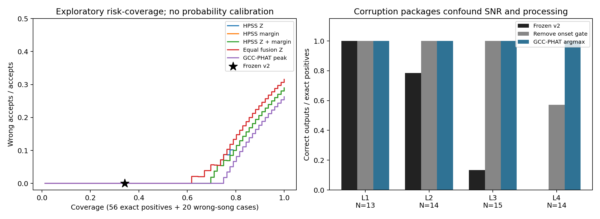
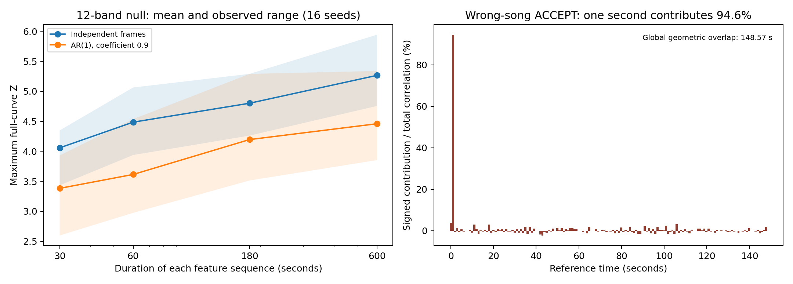

# Scientific study of selective audio alignment in RhythmAlign

Completed 2026-09-12. Scientific baseline: `ffa6b07a591dbdb54ae8350f3d27dce3ed74c847`. Resumed from `astra/alignment-research-wip`, WIP commit `5b1fcd472a94470872dc1f837a7f473c0edd5282`. Product relevance target: `20d48169803a0e62e4379f197a51b92f9ac6555b`.

## 1. Executive verdict

**Paper verdict: `ENGINEERING_ONLY`. Release-gate outcome: `RELEASE_BLOCKER_FOUND`.**

The release-blocking flaw is concrete: **v2 can accept a global offset between different songs when a brief, co-occurring feature event dominates PCEN correlation and obtains onset corroboration. Its 30-second overlap check measures the possible intersection of file timelines, not 30 seconds of matching content.** A dominant peak and a second family therefore do not establish that the selected reference belongs in the recording.

An exhaustive control using the existing 20 clean reference tracks produced **22 accepted directed wrong-song pairs out of 380**, representing **11 unordered pairs**. The first discovered clean pair, query `tr_lingduihua` and reference `tr_yanwulieche`, was independently rerun twice through the unmodified file-level engine. Both runs accepted **+1.462857 s**, CASE B. The selected PCEN-family evidence had **Z 13.109**, **margin 2.483**, onset **Z 2.012**, and geometric overlap **148.57 s**. Approximately **one second contributed 94.6% of the net signed plain-PCEN correlation at that lag**. Removing the first/last five seconds of feature support, or cropping those audio regions and regenerating features, changed this pair to ABSTAIN. This is localization evidence, not a validated general fix. [New counterexample validation](../../../experiments/alignment_research/results/counterexample_validation.json), [complete clean grid](../../../experiments/alignment_research/results/clean_mismatch_search.json).

This conclusion does not require treating an uncertain room recording as a strict no-shared-content null. A separate 551-pair recording/reference search found one accepted wrong-project pair, but another song could be audible in its background; that case retains this label caveat. Clean-source controls remove that particular uncertainty. Wrong-song identity is the task label; neither label asserts that two songs can never share a musical fragment.

The inherited 76-case comparison had looked much safer: **26 correct accepts, zero wrong accepts, 50 abstentions**. Yet simpler PCEN selectors gave higher coverage there, and GCC-PHAT recovered **56/56** exact-insertion positives. The additional challenges disprove any inference that the inherited zero-error result validates either full v2 or a simpler scalar threshold generally. These are descriptive results on reused sources, not normal-user failure rates. [Analysis](../../../experiments/alignment_research/results/analysis.json).

The literature already contains fingerprint/GCC verification and refusal to commit to unreliable synchronization. The current contribution is an engineering implementation plus a useful internal falsification record, not a demonstrated new alignment method. The strongest potential future contribution is an independently validated study of time-local evidence concentration and wrong-song confidence failures.

The final read-only comparison confirms that RA-1.2D retained the scientific logic and default thresholds. Its normal synchronization worker consumes ACCEPT and passes the offset to export. Thus integration does not invalidate the counterexample; it makes the accepted error consequential. **Do not clear the current default engine for release unchanged.** No production code, thresholds, media, release metadata, tags, or remote branches were changed in this task. Minimum closure is specified in §§12 and 18. [Relevance and verification record](../../../experiments/alignment_research/results/verification.json).

## 2. Repository / algorithm reconstruction

This reconstruction comes from executable code, the A/B/C experiment scripts and results, and relevant tests. Historical prose is treated as a claim to audit. Baseline source links: [v1](../../../auto_sync.py), [v2](../../../alignment_engine_v2.py), [A report](../../RA-1.2A-LOW-SNR-ALIGNMENT.md), [B report](../../RA-1.2B-ALIGNMENT-ENGINE-V2.md), [C report](../../RA-1.2C-CALIBRATION-HARDENING.md).

### 2.1 Signal model and sign

Let recording audio be approximately

\[
v(t)=a(t)\,\mathcal H[m(t-d)]+n(t),
\]

where the reference is `m`, `d` is the required reference placement on the recording timeline, `H` represents recording distortion, and `n` is structured interference. This model can fail when the wrong song is selected, multiple occurrences are present, or clock drift requires a time-varying map. The implemented estimator returns one constant shift.

FFmpeg decodes each complete input to mono 16-bit PCM at 22,050 Hz; librosa loads the decoded audio without another sample-rate change. The feature hop is 512 samples, approximately 23.22 ms. For a correlation-array index `k` with `Nv` recording frames,

\[
\ell=k-(N_v-1),\qquad d=-\ell\,512/22050.
\]

Positive offset delays the music; negative offset trims its beginning. Neither engine estimates tempo change or sampling-clock drift.

### 2.2 Production v1.1.x at the scientific baseline

Librosa Chroma CENS yields 12 pitch-class sequences. The code takes temporal first differences, prepending the first frame so that the initial difference is zero. It sums full FFT correlations over bands:

\[
C_{\rm chr}(\ell)=\sum_{b=1}^{12}\sum_t
\Delta X_m(b,t+\ell)\,\Delta X_v(b,t).
\]

With `S(C)=(C-mean(C))/std(C)`, the hybrid curve is

\[
C_{\rm hyb}=S(C_{\rm chr})+0.2 S(C_{\rm onset,centered}).
\]

The onset term correlates centered onset-strength envelopes. If curve lengths disagree, the implementation retains chroma alone. For a curve `C`, its reported peak Z is

\[
Z_{\max}(C)=\frac{\max C-\overline C}{\operatorname{sd}(C)}.
\]

V1 accepts the hybrid argmax immediately if Z is at least 2.0. There is no hybrid uniqueness or minimum-overlap check. Only after hybrid rejection does it try correlation of the **uncentered** onset envelopes. That fallback needs Z at least 2.0 and a peak ratio at least 1.05, comparing the maximum with the greatest curve value outside a 1.5-second exclusion region. Otherwise it raises low confidence. This is not a Gaussian significance test; even a signal-free search can have a large maximum, while a constant all-zero curve has no such meaningful peak.

### 2.3 V2 representations and evidence families

V2 runs four methods, grouped into three named families:

| Method | Family | Actual information |
|---|---|---|
| Hybrid | Tonal | The v1 hybrid already contains onset information. |
| Onset | Onset temporal | Raw onset-envelope correlation; different centering from the hybrid component. |
| PCEN+HPSS | PCEN spectral | Harmonic mel-power representation, PCEN, positive temporal difference, per-band normalization, summed correlation. |
| Plain PCEN | PCEN spectral | Same PCEN pipeline without the harmonic preprocessing. It participates in decisions. |

For PCEN, the mel-power spectrogram uses FFT length 2048, 96 mel bands, 30–4000 Hz. HPSS uses median kernel 31 on **mel power**, retaining the harmonic part. PCEN applies its library defaults, then positive first differences and per-row mean/std normalization with a small denominator constant. This is not a new PCEN or HPSS method. Preserving library versions and floating-point input scale matters. [PCEN paper](https://getreuer.info/papers/wang2017trainable/index.html), [HPSS paper](https://dafx.de/paper-archive/2010/DAFx10/DerryFitzGerald_DAFx10_P15.pdf), [librosa 0.11 documentation](https://librosa.org/doc/0.11.0/generated/librosa.pcen.html).

Each method nominates its four highest independent peaks. Independence here means a peak-finding separation of approximately 1.5 seconds, not stochastic independence. Candidates are sorted by offset and greedily inserted within 0.15 s of an evolving upper-median representative. This can form a cluster whose extreme members are more than 0.15 s apart.

Per-family measurement searches independent peaks within approximately ±0.30 s of the representative. A family must have a nomination in the cluster. Multiple members of that family can then compete to provide the largest Z; the same selected member provides the margin. Thus PCEN/HPSS are one named vote, but selecting their maximum still introduces selection and dependence. The method list in a serialized cluster does not identify which member supplied its winning score.

The margin compares the best independent peak inside the cluster window with the best outside it. It is not a posterior odds ratio. Family-counting also does not establish independence: all methods use the same audio and prominent acoustic events.

### 2.4 Frozen policy

For representative offset `d`, potential overlap is

\[
O(d)=\max\{0,\min(T_v,d+T_m)-\max(0,d)\}.
\]

V2 requires `O(d) >= 30 s`, then accepts a qualifying cluster through one of:

| Path | Conditions |
|---|---|
| CASE A | Tonal Z ≥ 5.0 and PCEN-family Z ≥ 5.6; both margins ≥ 1.0. |
| CASE B | PCEN-family Z ≥ 7.0, PCEN margin ≥ 1.4, and nominated onset evidence with Z ≥ 2.0. Tonal agreement is unnecessary. |

Despite a comment referring to an HPSS primary, CASE B can use **plain PCEN**. If more than one cluster qualifies, the engine abstains. With one qualifying cluster, it also abstains if a separated competitor has all deciding families at least 95% as strong in Z. For CASE A these are tonal and PCEN; for CASE B only PCEN is deciding. Competitors do not have to pass the accepted cluster's overlap check.

The returned offset preferentially comes from an HPSS-nominated candidate, chosen by candidate peak margin, even when another PCEN member supplied the accepted family score. Otherwise any nominated member can supply it. Consequently the output is not necessarily the cluster representative or the exact location at which every acceptance condition was measured.

ABSTAIN reasons describe checks at a selected strong cluster and are useful diagnostics. They are not exhaustive causal explanations or calibrated uncertainty categories.

## 3. Problem definition

The primary product task is to place the **selected reference song** into a recording of that song using one offset. A coincident generic onset or short common phrase between different songs is insufficient evidence for that whole-song operation.

Let `G(x)` denote the set of valid content offsets for input pair `x`, and let `g(x)` be acceptance. For a single-offset exact label, loss is `L=1[|d_hat-d*|>epsilon]`. For a no-match or wrong-song identity label, any output is a wrong accept. For a multi-occurrence pair, distinguish two contracts: content correctness (`d_hat` near any valid occurrence) and unique-placement correctness (an unambiguous occurrence must be determined). Refusing the latter need not imply that every local content match is false.

Reported outcomes are **CORRECT_ACCEPT**, **WRONG_ACCEPT**, and **SAFE_ABSTAIN**. Exact-insertion tolerance is 0.15 s; the manual anchor uses its documented interval `12.4 ± 0.4 s`. Repeated/partial cases receive explicit content/uniqueness labels and are not silently pooled with single-offset accuracy.

\[
\text{coverage}=E[g],\quad
R_{\rm sel}=\frac{E[gL]}{E[g]},\quad
\text{unconditional wrong fraction}=E[gL].
\]

Selective risk is undefined when nothing is accepted. Positive coverage and wrong-song acceptance are reported separately because a benchmark's positive/negative mixture changes both overall coverage and risk. A designed stress-test mixture is not a deployment distribution.

## 4. Hypotheses

The [experiment plan](EXPERIMENT_PLAN.md) predates the new probes. All analysis remains exploratory because the source corpus and prior reports were already available.

| Hypothesis | Completed evidence | Disposition |
|---|---|---|
| H1: within-feature Z is not universally reliable confidence | Null maximum grows with search length; clean wrong-song acceptance reaches PCEN Z 13.109. Yet HPSS Z ranks correctness very well on the inherited comparison. | Supported as a warning about interpretation and transportability. The stronger claim that Z has no predictive value is rejected. No probability-calibration error was measured. |
| H2: heterogeneous families add value beyond the best scalar feature | V2 beats unconditional argmax on rejection, but loses coverage to simple selectors on inherited data. Co-occurring features accept clean wrong songs. | Conditional usefulness, not demonstrated general superiority or independence. |
| H3: uniqueness is more predictive than absolute strength | Inherited margin AUC is slightly higher; a validated wrong-song margin is 2.483 and passes the full gate. | No general superiority established; uniqueness can be confidently wrong. |
| H4: selective alignment lowers error at useful coverage | Inherited v2 has 0/26 wrong among accepted but accepts only 26/56 positives; fresh challenges yield false accepts. | Selectivity is useful descriptively, but current thresholds do not establish a risk guarantee. “Useful” coverage requires a product cost judgment. |
| H5: HPSS materially improves low-SNR PCEN alignment | Argmax correctness improves from 45/56 to 54/56, concentrated at L4; full-policy removal changes no primary outcomes and loses the manual anchor. | Supported for this semi-synthetic representation comparison; not proven necessary generally or superior on independent acoustic data. |

## 5. Literature review

The [companion literature review](LITERATURE_REVIEW.md) supplies original citations, publication types, access limitations, and specific novelty consequences.

The nearest direct precedent is **Duong, Howson and Legallais (2012)**: fingerprint candidates followed by GCC-PHAT verification and confidence-based acquisition of more audio. **Six and Leman (2015)** likewise combine fingerprint synchronization with covariance refinement. This defeats a broad claim that heterogeneous synchronization evidence plus refusal is novel. [Duong et al.](https://doi.org/10.1109/ICCE-Berlin.2012.6336458), [Six and Leman](https://0110.be/files/attachments/434/2015.synchronized-recording.pdf).

Landmark fingerprints, robust bit fingerprints, and modern neural fingerprints are important comparisons. Chroma/onset combinations and DTW music alignment also precede v2; they address different robustness/precision or time-warping problems. [Wang 2003](https://www.ee.columbia.edu/~dpwe/papers/Wang03-shazam.pdf), [Haitsma and Kalker 2002](https://ismir2002.ismir.net/proceedings/02-FP04-2.pdf), [Chang et al. 2021](https://mimbres.github.io/neural-audio-fp/), [Ewert et al. 2009](https://resources.mpi-inf.mpg.de/MIR/SyncRWC60/2009_EwertMuellerGrosche_HighResAudioSync_ICASSP.pdf), [SyncToolbox](https://joss.theoj.org/papers/10.21105/joss.03434).

Searching for an unknown peak changes significance relative to testing a known location. Reject-option and selective-classification literature supplies an appropriate evaluation vocabulary, not automatic guarantees for hand-tuned gates. [Vio and Andreani 2016](https://www.aanda.org/articles/aa/pdf/2016/05/aa27463-15.pdf), [Chow 1970](https://doi.org/10.1109/TIT.1970.1054406), [El-Yaniv and Wiener 2010](https://jmlr.org/papers/v11/el-yaniv10a.html).

## 6. Novelty assessment

**Assigned level: Level 0 — engineering only, for the currently demonstrated method.** Existing techniques are combined in a task-specific policy. The study adds reproducible negative evidence and identifies a concrete failure mechanism; it does not establish that this phenomenon is new across audio alignment or that v2 introduces a general solution.

A Level 1 empirical contribution is possible if the evidence-concentration failure persists across independently acquired sources, stronger baselines, and controlled manipulations, and is useful beyond these files. That is a research opportunity, not a completed novelty claim. Level 2 would require a demonstrably new and superior method; Level 3 would additionally require generalization beyond this application. Neither is supported.

## 7. Dataset audit

### 7.1 Evidence categories

| Evidence | What it supports | What it does not support |
|---|---|---|
| One manual interval for 零对话 | Grossly distinguishes −1.997 s from the +12.4 s region. | Independent 90 ms precision or a population accuracy rate. |
| 56 exact-insertion positives | Accuracy against the digital insertion offset under documented corruptions. | Real acoustic performance under arbitrary microphone/room/clock effects. |
| Remaining real positive recordings | Pairing and agreement/consistency evidence. | Independent timing correctness. |
| Deliberate wrong-project pairs | Rejection under source-identity mismatch. | A normal-user failure rate or guaranteed absence of background fragments. |
| Clean wrong-song controls | Known single-reference input identity; no unknown room mixture. | Statistical independence of reciprocal pairs or a proof of zero musical similarity. |
| Tiled and repeated inputs | Behavior under specified content ambiguity. | A unique ground-truth placement unless the task contract supplies one. |
| Owner listening | A qualitative verdict on the particular viewed export. | An enlarged labeled dataset or finer numerical timing ground truth. |

At the frozen baseline, the owner listening gate was pending. In the later read-only relevance check, RA-1.2D documentation records **owner PASS for the motivating export**. This is explicitly post-baseline context. It was not used to tune or relabel the scientific corpus and does not resolve wrong-song rejection.

### 7.2 Dependence, exposure and construction

The source set has **20 projects and 29 recordings**. Multiple recordings share projects, including six `haiditan` and four `fenzhen` recordings. Tracks and backgrounds are reused across noise levels and negative pairings. Every one of the **16 recordings in the 10-project historical holdout** had appeared in RA-1.2B development results. The RA-1.2C split is mechanically project-disjoint within that experiment; it is not a never-exposed test set for the algorithm's development history. [Audit](../../../experiments/alignment_research/results/audit.json).

Positive construction couples noise level and signal processing: L1 approximately −6 dB; L2 −12 dB with band limiting; L3 −18 dB with added reverberation; L4 −24 dB with nonlinear saturation. These are corruption packages, not an isolated SNR experiment. Gain is based on whole-array/track RMS, not measured active-overlap SNR. The digitally added reference retains a strong direct waveform relationship, there is no clock drift, and construction does not recreate an independent loudspeaker/microphone path. This materially favors waveform methods.

“Onset density” in hard-negative selection is actually a mean onset-strength summary. Choosing one feature-similar target per recording is not a search for the most dangerous accepted offset. The exhaustive grids added here expose that selection limitation.

The split auditor does not enforce every claimed seed/content-identity constraint; the positive seeds happen to be unique. IDs alone do not prove recording independence. The study hashes entire source files and decoded arrays rather than relying on filenames or the production cache's partial-file key.

### 7.3 Corrections to historical claims

The prominent RA-1.2C PCEN-family Z around **13** was from **tiled target-containing ambiguity cases**, not the reported wrong-song hard negatives: calibration tiled `samesha` was 13.004 and holdout tiled `haiditan2` 13.431. The largest wrong-song PCEN-member Z in those results was approximately **7.316**. Claims that all “garbage” margins were at most about 1.01–1.06 also conflate strata: wrong-song calibration cases reached about 1.239 and tiled holdout about 1.308. The new clean wrong-song counterexample supplies stronger evidence for high-Z false acceptance, but it cannot retroactively fix the old attribution. [Audit, negative rows](../../../experiments/alignment_research/results/audit.json).

The old synthetic null results contain a family co-ranking case before floors, so a universal “never co-rank” formulation is too strong. A/B threshold choices were informed by these sources and the motivating example; the PCEN sweep spans 36 configurations. Its `REAL_OFFSET=12.4227` is a prediction-derived reference value, not a more precise independent manual label.

Window analysis in A uses locally standardized curves and local offsets. Without restoring window start times and comparing contributions in a common normalization, it does not establish which interval causes the full-recording maximum. The present counterexample attribution instead sums per-frame products from the original globally normalized features.

## 8. Experimental protocol

The preserved corpus contains **81 cases**: 56 exact positives, 20 wrong-song cases, four tiled cases, and the manual anchor. Primary comparisons use the first two strata, **N=76**. The 20 negative source pairs are distinct. The later 551-pair exhaustive search includes these 20; their denominators must not be added.

All four scientific inputs checked by the harness remain identical to `ffa6b07` after allowing Git newline conversion: both engine modules, the semi-synthetic constructor, and its plan. Original `corpus.json` and `audit.json` retain the WIP Git content; the resume did not regenerate them. Windows checkout CRLF differs from repository blob LF, which the verification record reports explicitly.

Baselines use the same full decoded audio. Feature baselines use frozen curves; pure chroma is separately extracted. Equal fusion averages standardized hybrid, HPSS and onset curves. Naive voting accepts when at least two of four method argmaxes agree within 0.15 s, counting PCEN variants separately; it is deliberately labeled naive. V1 includes its actual onset fallback.

Waveform Pearson NCC recomputes local means and energies at each overlap. GCC-PHAT normalizes the cross-spectrum before inverse FFT. Both use a documented common resampling to 7,350 Hz and require at least 30 seconds of geometric overlap. Their tabulated argmax variants do not have a calibrated reject rule. Synthetic ±2.5 s shift controls verify sign and sample-level recovery for both implementations. [Harness](../../../experiments/alignment_research/study.py), [verification](../../../experiments/alignment_research/results/verification.json).

No fingerprint system, neural fingerprint model, or DTW system was fairly reproduced in this run. Their absence limits publication claims. GCC-PHAT was prioritized because it directly challenges the need for v2 on same-master insertion data; DTW is less directly matched to the constant-shift task. A home-made weak fingerprint substitute would not answer the literature comparison.

Scalar selector thresholds of Z 7 and margin 1.4 are diagnostic reuse of existing policy constants. Swept risk-coverage curves and AUCs are retrospective descriptions, not selected deployment thresholds. No logistic model, isotonic map, meta-classifier, or conformal predictor was fitted. The existing data cannot honestly support their probability or risk guarantees.

The detailed commands, seeds and completion status are in [EXPERIMENT_PLAN.md](EXPERIMENT_PLAN.md); result metadata records Python and scientific-library versions, frozen SHA, policy values, source hashes and commands. Temporary decoded audio/features remain in ignored local scratch; source media were only read.

## 9. Additional experiments

| Completed experiment | Fixed design and purpose | Evidence |
|---|---|---|
| Full-curve replay and baseline analysis | Replay all 81 preserved decisions; compare the 70 RA-1.2C semi-synthetic/tiled/hard-negative results with committed decisions and reasons. | [analysis.json](../../../experiments/alignment_research/results/analysis.json) |
| Feature-space nulls | Durations 30/60/180/600 s × 1/12/96 dimensions × AR coefficient 0/0.9 × 16 seeds = 384 draws. Independent Gaussian sequences, row normalization, full correlation. | [feature_nulls.json](../../../experiments/alignment_research/results/feature_nulls.json) |
| Audio nulls | Durations 30/90/240 s × Gaussian or Gaussian-plus-taps × six seeds = 36 cases; deterministic musical reference, no target mixed into query. | [audio_nulls.json](../../../experiments/alignment_research/results/audio_nulls.json) |
| Actual support | Five arrays containing only 1/3/8/20/40 s of a reference excerpt in a 90 s noisy query. | [safeguards.json](../../../experiments/alignment_research/results/safeguards.json) |
| Repeated occurrence | Three disjoint two-occurrence mixtures and four close equal-replica mixtures. | Same safeguard result |
| Decision-seam geometry | Three artificial family-curve constructions probing clustering/output selection. No assertion that these curves come from natural audio. | [curve_counterexamples.json](../../../experiments/alignment_research/results/curve_counterexamples.json) |
| Exhaustive recording mismatch | 29 recordings × 19 other-project references = 551. Fresh per-source features; 21 preserved real-pair equivalence checks. | [mismatch_search.json](../../../experiments/alignment_research/results/mismatch_search.json) |
| Post-discovery clean control | 20 clean reference queries × 19 other references = 380 directed pairs. All outcomes retained. | [clean_mismatch_search.json](../../../experiments/alignment_research/results/clean_mismatch_search.json) |
| Counterexample validation | Two full file-entry repeats for the room-recording candidate and two for the first clean candidate; known-own-track control, clean wrong-reference control, temporal contribution decomposition, boundary support removal, fresh audio crop, and method removal. | [counterexample_validation.json](../../../experiments/alignment_research/results/counterexample_validation.json) |

The clean grid and its follow-ups were added after the first recording mismatch acceptance, specifically to test whether unknown background music explained that observation. They are labeled post-discovery; they are not retrospectively described as pre-registered. Thresholds were never retuned. Speech-specific, realistic codec, microphone, clock-drift, and independent-room factorial sweeps were not completed and are not claimed as evidence.

## 10. Results

### 10.1 Preserved comparison and strong simple baselines

All **81/81** curve replays matched stored offsets and reason codes. The **70** corresponding committed RA-1.2C cases had **zero** outcome/reason discrepancies. This establishes continuity with the paused work, not correctness of every label. [Analysis](../../../experiments/alignment_research/results/analysis.json).

Primary N=76 consists of 56 exact positives plus 20 designed wrong-song negatives. CA/WA/SA mean correct accept, wrong accept, and safe abstention. All counts below are new-study evaluations over the preserved corpus.

| Method | CA | WA | SA | Coverage | WA / accepted |
|---|---:|---:|---:|---:|---:|
| V1 / hybrid | 29 | 47 | 0 | 100% | 47/76 |
| Chroma argmax | 30 | 46 | 0 | 100% | 46/76 |
| Onset argmax | 13 | 63 | 0 | 100% | 63/76 |
| Plain PCEN argmax | 45 | 31 | 0 | 100% | 31/76 |
| HPSS-PCEN argmax | 54 | 22 | 0 | 100% | 22/76 |
| Equal standardized fusion | 52 | 24 | 0 | 100% | 24/76 |
| Waveform Pearson NCC argmax | 54 | 22 | 0 | 100% | 22/76 |
| GCC-PHAT argmax | 56 | 20 | 0 | 100% | 20/76 |
| Naive 2-of-4 vote | 45 | 4 | 27 | 64.5% | 4/49 |
| Frozen v2 | 26 | 0 | 50 | 34.2% | 0/26 |
| HPSS Z ≥ 7 | 52 | 0 | 24 | 68.4% | 0/52 |
| HPSS margin ≥ 1.4 | 50 | 0 | 26 | 65.8% | 0/50 |
| HPSS Z ≥ 7 and margin ≥ 1.4 | 50 | 0 | 26 | 65.8% | 0/50 |

Unconditional methods necessarily accept every negative here. Their negative WA counts are not evidence that a properly calibrated GCC/fingerprint rejector must fail. Conversely, scalar selectors' zero-error rows do not license replacement of v2: the expanded mismatches invalidate that extrapolation.

For exact positives only, v2's coverage is **26/56 (46.4%)**. Naive voting makes one wrong positive output and accepts three negatives. The manual anchor is separate: v1 outputs −1.9969 s; v2 outputs +12.4923 s inside the documented interval. NCC fails this anchor; GCC-PHAT and the PCEN representations reach the correct interval. This prevents treating the insertion benchmark's NCC performance as universal.

| Corruption package | N positives | PCEN correct | HPSS correct | GCC-PHAT correct | V2 correct accepts | V2 without onset corroboration |
|---|---:|---:|---:|---:|---:|---:|
| L1 | 13 | 13 | 13 | 13 | 13 | 13 |
| L2 | 14 | 14 | 14 | 14 | 11 | 14 |
| L3 | 15 | 15 | 15 | 15 | 2 | 15 |
| L4 | 14 | 3 | 12 | 14 | 0 | 8 |

V2's gate discards many offsets that stronger individual representations recover. The L4 HPSS gain is substantial within this construction, but GCC-PHAT's 56/56 result exposes how much direct waveform information remains in the semi-synthetic data.

### 10.2 Risk-coverage and score ranking

Correctness-ranking AUC on these 76 cases is **0.991 for HPSS Z**, **0.994 for HPSS margin**, **0.994 for their normalized minimum**, **0.977 for hybrid Z**, **0.991 for equal-fusion Z**, and **1.000 for GCC-PHAT peak**. Each score ranks correctness of its own estimator, so these are not identical classification targets. No uncertainty interval is justified by treating the variants as iid. The small AUC difference between margin and Z does not establish superiority. [Score data and thresholds](../../../experiments/alignment_research/results/analysis.json).

The left curves are retrospective score-threshold sweeps, not calibrated operating policies. The star is the one frozen v2 operating point. The right panel reports exact-positive recovery, with processing and SNR deliberately labeled as confounded. The clean wrong-song challenge below is a separate stratum and is not hidden in this favorable figure.

### 10.3 Search-length and null results

For 12 independent feature dimensions, mean maximum Z increases from **4.058 at 30 s** to **4.486 at 60 s**, **4.801 at 180 s**, and **5.266 at 600 s**. The largest 600 s draw is **5.944**. With AR(1) coefficient 0.9, corresponding means are **3.383, 3.615, 4.196, 4.460**. These are 16-seed cell summaries; shared seeds across cells and frames within sequences prohibit treating all 384 rows as independent audio trials. [Null cells](../../../experiments/alignment_research/results/analysis.json).

Feature dimension does not mechanically increase normalized Z: under the independent-frame construction, 30 s means for dimensions 1/12/96 are **4.127/4.058/4.256**, and 600 s means **5.200/5.266/5.336**. Summing more independent standardized bands also changes variance. Actual musical cross-band dependence is a separate issue.

All **36/36 audio nulls abstain**. Their maximum method Z values are approximately hybrid **5.318**, onset **1.977**, plain PCEN **5.688**, HPSS **6.651**. The 30 s cells are additionally constrained because essentially only zero lag can meet 30 s overlap. The 90/240 s cells help avoid mistaking that geometric restriction for statistical safety. Their synthetic reference is reused; these are controlled probes, not 36 independent songs.

For illustration only, if M searched standardized values were independent standard normals, `P(max <= z)=Phi(z)^M` and a typical maximum grows on the order of `sqrt(2 log M)`. Actual lag values share samples, their variance changes with overlap, the features are non-Gaussian, and music is structured. Therefore this expression motivates the experiment; it is not a p-value formula for v2. [Peak-selection background](https://www.aanda.org/articles/aa/pdf/2016/05/aa27463-15.pdf).

### 10.4 Expanded mismatch challenges

| Query/reference stratum | N | Frozen v2 accepts | HPSS Z ≥ 7 accepts | HPSS margin ≥ 1.4 accepts | HPSS both accepts |
|---|---:|---:|---:|---:|---:|
| Existing room recordings × other-project tracks | 551 | 1 | 1 | 6 | 1 |
| Clean tracks × other tracks, directed | 380 | 22 | 52 | 50 | 36 |

The clean v2 accepts consist of **20 CASE B** and **two CASE A** results. Reverse directions duplicate the underlying song-pair challenge: 22 directed accepts represent 11 unordered pairs. Do not report 22 independent failures, and do not estimate a user failure rate as 22/380. The result establishes existence and defeats the universal safety claim; it does not establish prevalence. [All mismatch summaries](../../../experiments/alignment_research/results/analysis.json).

## 11. Ablations

### 11.1 Gate and representation removal

These variants change only the isolated research process. Production policy stays frozen. Primary counts again use N=76.

| Variant | CA | WA | SA | Interpretation |
|---|---:|---:|---:|---|
| Full v2 | 26 | 0 | 50 | Reference operating point. |
| Remove HPSS member | 26 | 0 | 50 | No primary count change; the separate manual anchor is lost. |
| Remove plain PCEN member | 26 | 0 | 50 | No primary count change; the manual anchor remains. |
| Remove tonal family | 6 | 0 | 70 | CASE A accounts for much useful coverage. |
| Remove minimum overlap | 26 | 0 | 50 | This corpus does not establish marginal value of the guard. |
| Remove uniqueness floors | 17 | 0 | 59 | More candidates pass, causing multiple-cluster abstention; coverage can decrease. |
| Replace hybrid with pure chroma | 26 | 0 | 50 | Embedded onset is unnecessary for these final primary decisions. |
| Remove CASE B onset corroboration checks | 50 | 0 | 26 | Recovers many correct insertions; does not validate deployment safety. |
| Bypass both ambiguity mechanisms | 26 | 0 | 50 | No primary count effect at these floors; not a proof the mechanism is unnecessary. |

All four inherited tiled cases still abstain under these variants. Strong single-feature selectors can accept tiled content, which illustrates why their apparently better primary risk-coverage does not settle the unique-placement task. Tiled construction repeats a short beginning excerpt while querying the full original track; it is not automatically a set of equally strong full-track matches.

On the validated clean wrong-song pair, removing **plain PCEN alone still accepts**, removing **HPSS alone still accepts**, and removing **hybrid still accepts**. Removing the onset method makes it abstain because CASE B no longer has corroboration. That does not imply that simply eliminating onset checks helps: eliminating the *requirement* has the opposite meaning from eliminating the observed method. Neither “disable plain PCEN” nor “use only HPSS” fixes this example. [Counterexample method removals](../../../experiments/alignment_research/results/counterexample_validation.json).

### 11.2 Feature-curve dependence and error dependence

On the 56 exact positives, full-curve Pearson correlation and top-1 error coincidence show different aspects of dependence:

| Pair (A, B) | Both correct | A wrong only | B wrong only | Both wrong | Median curve r | Error phi |
|---|---:|---:|---:|---:|---:|---:|
| Hybrid, HPSS | 29 | 25 | 0 | 2 | 0.096 | 0.199 |
| HPSS, plain PCEN | 45 | 0 | 9 | 2 | 0.358 | 0.389 |
| Hybrid, pure chroma | 29 | 1 | 0 | 26 | 0.981 | 0.965 |
| Onset, HPSS | 13 | 41 | 0 | 2 | 0.029 | 0.106 |

Hybrid/chroma are nearly redundant here. HPSS recovers cases where other representations fail; on these positives its two errors are also errors for the compared representations. Small full-curve r does not prove that extreme peaks or wrong-match events are independent. In particular, a long uncentered onset curve can have low Pearson correlation with a centered PCEN curve while both select the same brief event. The clean wrong-song example demonstrates exactly the operational dependence that family names conceal. [Complete pairwise counts](../../../experiments/alignment_research/results/analysis.json).

## 12. Failure analysis

### 12.1 The motivating failure, interpreted scientifically

For 零对话, v1's hybrid peak at **−1.9969 s, Z 5.485** wins within its representation and passes its gate. Onset peaks at **+12.4459 s, Z 2.268**, but its ratio around **1.001** fails v1's uniqueness rule. HPSS returns **+12.4923 s, Z 10.44, margin 1.893**. The independent manual interval is **+12.4 ± 0.4 s**. These observations show that the hybrid's preferred explanation is wrong in this recording, while another representation retains useful information. They do not show that Z is always uninformative or that an HPSS peak is a calibrated probability. [Preserved manual row](../../../experiments/alignment_research/results/corpus.json).

A feature map is many-to-one. Distinct signals can share changes of pitch class, broad spectral energy, or event timing. A sharp correlation peak says that one lag is unusually favorable **under that representation and this search**, not that the whole reference recording occurs there. Repeated material can create several true content offsets; a shared transient can create one dominant false whole-song candidate. Neither situation is resolved by salience alone.

### 12.2 Validated wrong-song acceptance and its narrow mechanism

The clean inputs are two different source tracks, not noise synthesized from the target and not a room recording with unknown background. Their complete file hashes and decoded hashes are in the validation artifact. The first grid acceptance was rerun through `find_offset_v2` twice; independent per-pair generators exactly matched reused features, with **maximum absolute curve difference 0.0 for all four methods**.

At **+1.462857 s**, plain PCEN supplies CASE B's winning family evidence: Z **13.10877**, margin **2.48297**. HPSS independently nominates the same lag, Z **9.95563**, margin **1.83497**. Onset nominates **+1.486077 s**, Z **2.01154**. No second cluster triggers ambiguity. The geometrically possible overlap is **148.571 s**.

Decomposing `sum_b,t X_m(b,t) X_v(b,t+shift)` at that lag, without window-wise renormalization, attributes **94.563% of the net signed plain-PCEN sum** and **70.128% of the HPSS sum** to the approximately one-second reference bin starting at **0.99846 s**. This is a fraction of a signed sum, not “percentage of identical audio” or an independent probability. Low waveform correlation at the reported lag is additional diagnostic evidence; the one-second waveform Pearson values have median approximately −0.0055 and maximum absolute value 0.0923. Waveform NCC/GCC argmaxes do not corroborate this offset.

Both masking the first/last five seconds of existing features and separately cropping those audio regions then regenerating features cause ABSTAIN. This localizes the current counterexample to boundary-region evidence. It does **not** prove a particular PCEN initialization formula is the sole cause: ordinary onset structure, normalization, HPSS, and representation collisions remain possible contributors. The established decision flaw is accepting a whole-song alignment without checking distributed content support.

The recording candidate `haiditan_ds_1` × `tr_hongzhoutian` accepts **+59.721723 s** twice through the file entry, CASE A, with hybrid Z **5.693** and HPSS Z **12.625**, margins **1.453/2.335**, overlap **92.34 s**. NCC and GCC also peak nearby. Its own reference aligns at +11.192 s by v2, but that value is not a new independent manual label. Possible unrelated background music is unresolved. Therefore **this room-recording example is not needed as a strict no-shared-content proof for the release blocker**.

### 12.3 Other safeguard falsifications

In the partial-support sweep, **1 s and 3 s abstain; 8 s, 20 s and 40 s accept near +10.0078 s**. The query has 90 s duration and the reference 60 s; the measured geometric overlap is 60 s, even when actual shared input support is only eight seconds. The local offset is correct, so this is a guard-semantics counterexample rather than a falsely labeled numerical error.

Two disjoint full-reference occurrences at +5/+55 s, with second gains 1.0/0.85/0.5, all abstain. Close equal replicas at separations **0.35, 0.7 and 2.0 s accept** near +4.9923 s; **1.2 s abstains**. Both inserted occurrences are content-correct. These cases refute a universal unique-occurrence promise, but do not establish a uniquely labeled direct-path timing error.

In artificial-curve tests, the evolving cluster median, ±0.30 s scoring window, and HPSS output preference permit acceptance at **7.5697 s**, about **0.2697 s** from a 7.30 s tonal nomination, despite nominal 0.15 s clustering. This is a decision-seam contract gap, not a physically demonstrated audio error. [Safeguards](../../../experiments/alignment_research/results/safeguards.json), [curve probes](../../../experiments/alignment_research/results/curve_counterexamples.json).

### 12.4 Release gate and minimum closure

**Release outcome: `RELEASE_BLOCKER_FOUND`.** Under the requested wrong-song/partially mismatched alignment contract, a repeatable accepted different-song offset driven predominantly by a brief boundary event is a blocking correctness flaw. This judgment does not depend on claiming an unacceptable population error percentage or a failure in every ordinary same-song input.

The minimum concrete regression is the full-file `tr_lingduihua` → `tr_yanwulieche` pair with expected **ABSTAIN** for whole-song alignment, retaining hashes and the reverse-direction case. The entire 380 clean grid and 551 room grid must accompany it to prevent a one-example threshold patch. The 56 exact positives and the manual anchor measure the resulting loss of useful coverage.

The minimum *type* of algorithmic fix is **candidate-level verification of temporally distributed matching content before converting ACCEPT into a whole-song placement**. For example, require consistent local alignment evidence in separated windows that establish actual shared support, and reject an offset supported only by a brief high-contribution event. Candidate windows, support duration and acceptance calibration need a fresh development/test split; this study does not supply a validated numeric setting. Simply raising Z, raising a top-two ratio, changing reason text, disabling plain PCEN, or reinstating v1 is not supported as a fix. Cropping five seconds is a diagnostic intervention, not the proposed production remedy.

Until such a guard or another independently validated verifier passes the regression and coverage checks, the current automatic ACCEPT path should not receive release clearance unchanged. Any temporary product containment should prevent an unverified ACCEPT from automatically authorizing export, while preserving explicit owner control. This is a recommendation only; no product behavior was changed.

The post-study read-only check against `20d4816` found identical executable ASTs after explicitly excluding docstrings, `ENGINE_LABEL`, and the ETA realtime-factor assignment. Requirements are unchanged. The inspected worker calls `find_offset_v2(v_path,m_path)` without policy overrides; ACCEPT reaches the synchronization export path and ABSTAIN stops. Thus the same flaw remains algorithmically relevant to RA-1.2D. The stored source excerpts and normalized AST hashes make this check reviewable. [Verification](../../../experiments/alignment_research/results/verification.json).

## 13. Selective-alignment / abstention analysis

Selective prediction is a valid framing because errors are incurred only when a system elects to provide an offset, and abstention has a real cost. V2 is a heuristic selective estimator with a multivariate gate. Its score is not a posterior probability, and its fixed acceptance region has not been calibrated to a desired maximum error rate. [Selective-classification foundation](https://jmlr.org/papers/v11/el-yaniv10a.html), [risk-coverage practice](https://papers.nips.cc/paper_files/paper/2017/hash/4a8423d5e91fda00bb7e46540e2b0cf1-Abstract.html).

If a calibrated probability of correctness `p` existed, a simple decision loss with wrong-output cost `Cw` and refusal cost `Ca` would accept when `Cw(1-p) <= Ca`. The present pipeline estimates no such `p`, and the costs are not specified. Naming an offset “accepted” therefore cannot itself establish the desired risk trade-off.

Risk-coverage plots are more informative than one favorable zero-error operating point. But a threshold fitted after viewing those plots must be treated as development. For a theoretical illustration, zero errors in nine independent accepted cases would still give an approximately **28.3%** one-sided 95% upper binomial bound; zero in 26 would give **10.9%**. Approximately **299 independent zero-error accepted cases** are needed for a 1% upper bound by that simple calculation. These are not valid confidence bounds for the correlated current corpus. [Recorded calculation](../../../experiments/alignment_research/results/analysis.json).

A small logistic or isotonic calibrator can easily fit reused-source artifacts and would not solve missing content support. A simpler rule is preferable while data are limited, provided its limitations are measured. A learned meta-classifier should be compared against the simplest scalar and structural selectors, not justified merely by being learned. Calibration literature does not make an arbitrary confidence number probabilistic. [Guo et al.](https://proceedings.mlr.press/v70/guo17a.html).

Risk-control methods may eventually calibrate a finite set of predeclared policies on fresh exchangeable units. Ordinary conformal coverage of a candidate set is not automatically low wrong-accept risk after selecting one offset: no-match must be represented, candidate recall matters, and singleton selection changes the relevant event. Moreover, v2 acceptance is nonmonotone in some floors because extra qualifying clusters trigger refusal. These assumptions must be handled explicitly. [Learn then Test working paper](https://www.gsb.stanford.edu/faculty-research/working-papers/learn-then-test-calibrating-predictive-algorithms-achieve-risk), [Conformal Risk Control](https://proceedings.iclr.cc/paper_files/paper/2024/hash/f3549ef9b5ff520a7e41ff3cc306ab2b-Abstract-Conference.html).

Reason codes should remain descriptions of failed checks. Neither a “dual-family” label nor a “primary corroborated” label is a confidence guarantee. A future diagnostic could expose support duration, concentration, and competing placements, but this task did not implement those product changes.

## 14. Threats to validity

The most serious limitations are source reuse and development exposure, few independent real timing labels, the digitally mixed direct-path advantage, confounding of noise and processing, and data-dependent adversarial follow-ups. Pairwise curves and candidate scores contain many dependent observations. The clean grid has reciprocal pairs; the room grid repeatedly queries the same recordings and references. No p-values or source-naive bootstrap intervals are used.

Wrong-song identity and no shared audio are different concepts. The clean example is a wrong whole-song placement even if a generic onset or brief common phrase is similar. The room example may contain the other song in the environment and remains qualified. The study does not invent a listening verdict or imply that low waveform correlation proves musical nonidentity.

The feature nulls simplify real music. Audio nulls use a reused deterministic reference. Neither can establish all real-noise false-accept behavior. Conversely, the clean negative control is deliberately strong audio and may be uncommon in normal low-SNR use; its purpose is to test the gate's correctness claim, not estimate encounter frequency.

No natural-audio clock-drift benchmark, independent microphone-path sweep, or fair landmark/neural-fingerprint baseline was completed. DTW is not assessed. Existing resource tests and present runtimes describe particular durations and one machine, not asymptotic constant-time alignment. HPSS and full lag searches have real computational costs; a future verifier must be measured end-to-end.

The full frozen baseline suite passes **48 tests**. Those tests establish implemented behavior and regression stability, not the scientific validity of ACCEPT. The new counterexamples explain why passing them cannot clear the release gate. The study's waveform sign controls pass, baseline inputs match, preserved decisions replay, and figures were visually inspected. The virtual environment lacked `psutil`; completed testing used the recorded global Python environment instead. [Verification](../../../experiments/alignment_research/results/verification.json).

The study does not preserve local raw audio in Git or publish media. Reproduction on another machine requires authorized access to sources matching the manifest hashes. Path-free results and scripts support auditability but do not turn a private corpus into a publicly downloadable benchmark.

## 15. Paper-worthiness verdict

**`ENGINEERING_ONLY`** is the current paper verdict. The strongest contribution is an auditable implementation study that corrects overstatements, challenges favorable benchmarks with strong simple baselines, and finds a real gate failure. The strongest counterargument to a paper is that its methodological ingredients and confidence/rejection motivation are established prior work, while its data cannot support generalization.

The largest methodological weakness is the absence of independent source-level acoustic evaluation and sufficiently precise real labels. The nearest prior method is Duong et al.'s fingerprint/GCC verification; the strongest reproduced challenge on current positives is GCC-PHAT. A fresh benchmark with whole-song identity, timing and support labels is the minimum additional research needed before claiming more than an engineering report.

Safe claims today: v2 rejects many designed mismatches, recovers the motivating interval, sacrifices considerable insertion-positive coverage, and fails repeatable clean wrong-song controls. HPSS helps argmax robustness in the existing L4 construction. Z and margins can rank some cases well without transporting to other input types. The current overlap and family checks do not certify time-distributed match support.

Unsafe claims today: calibrated correctness probability; bounded normal-user wrong-accept risk; independent evidence families; general superiority over GCC/fingerprints; a clean virgin holdout; universal ambiguity rejection; a 30-second shared-content guarantee; state-of-the-art robustness; or a new general fusion/abstention method.

## 16. Candidate paper framing

The condition for proposing 2–4 paper framings is not met: the verdict is engineering only. No submission-ready outline or venue claim is supplied.

The strongest *conditional future thesis* is: **global peak salience and cross-family agreement can be dominated by a short common event, while time-distributed content verification may improve the wrong-accept/coverage trade-off in constant-offset audio synchronization.** The first clause has concrete local evidence here; the second is an untested proposed remedy. It becomes a paper thesis only if it survives a fresh source-level benchmark and strong established verification baselines. This is not a claim that v2 has solved that research problem.

## 17. Hostile reviewer simulation

Scores below use an explicit 1–10 scale, with 1 strong reject and 10 strong accept. They are simulated judgments, not external reviews.

### Reviewer A — audio / music-information-retrieval expert: 2/10

“The system combines known chroma, onset, PCEN, HPSS, correlation, and thresholds. Audio fingerprint verification already addresses related failure modes. There is no reproduced landmark baseline, no fair learned fingerprint comparison, and GCC-PHAT solves every exact insertion positive. One private game-recording corpus cannot establish a new alignment method.”

**Most persuasive new evidence:** a blind source-disjoint acoustic benchmark showing that a specified verifier beats a serious fingerprint-plus-refinement baseline and calibrated GCC/PCEN alternatives at matched coverage and timing tolerance.

**Author response:** We agree that the broad method novelty is unsupported and therefore assign engineering only. We reproduced strong waveform baselines and report their success rather than conceal it. Fingerprint comparison and external acoustic generalization remain **unresolved**.

### Reviewer B — statistics / uncertainty expert: 2/10

“Z was never a probability. Calling this miscalibration without a probability map is imprecise. Thresholds and representation choices saw the source corpus; holdout recordings appeared earlier in development. Risk estimates reuse projects and augmented variants. A rare selected counterexample disproves a universal statement but does not estimate risk. Conformal terminology cannot rescue these assumptions.”

**Most persuasive new evidence:** predeclared source-level calibration/test separation with exact selective-risk definitions, matched coverage, a stated wrong-output cost, and enough independent accepted cases to support the claimed risk bound.

**Author response:** We distinguish score transportability from probability calibration, report counts and exploratory risk-coverage, and make no current population guarantee. The release blocker is based on a repeatable contract violation, not a significance test. Independent risk estimation remains **unresolved**.

### Reviewer C — applied-systems expert: 3/10

“Digital mixtures preserve a direct waveform that real rooms may destroy. Clean different-song inputs may be uncommon, but they reveal that the product can export a wrong reference after ACCEPT. The minimum-overlap wording overpromises content support. Private assets limit reproduction; a new verifier could make latency and abstention unacceptable.”

**Most persuasive new evidence:** an end-to-end evaluation of the proposed fix on independently labeled real recordings, with whole-song/partial-content controls, accepted-case errors, recovery coverage, runtime, and explicit manual-recovery behavior.

**Author response:** The counterexample is reproduced through the actual file API and remains relevant to the default integration. Source hashes, construction code and full outcomes are retained; public data release is not claimed. A production fix, its latency and a measured human-recovery cost are **unresolved** and outside this no-production-change task.

The honest author response is to revise the claim downward, preserve the negative result, and run the next experiment. There is no defensible rebuttal that converts current evidence into a novel general method.

## 18. Minimal next research step

**Run one blinded, source-disjoint temporal-support challenge.** Use 20 previously unseen reference songs, reserving ten complete source projects for development and ten for untouched testing. For each test song, record two microphone sessions, each at two predefined difficulty levels, plus a wrong-song control and a deliberately short shared-event/partial-content control with explicit labels. This yields 40 real positive recordings and 20 designed negative/partial cases in the test half; songs and acoustic sessions, not windows or reciprocal pairs, are the units of dependence. Acquisition and manual timing checks must be independent of the engine's proposed offsets.

Before opening test results, freeze v2, a simple HPSS selector, GCC-PHAT with a development-calibrated reject rule, an established fingerprint verifier, and one proposed distributed-support gate. Evaluate whole-song CA/WA/SA, local-content correctness separately, positive coverage, accepted risk, support concentration, and end-to-end runtime. Re-run the archived counterexamples as development regressions, not fresh test cases. Do not tune a cutoff on the new test failures.

This one experiment has the highest information value for both the release fix and the possible empirical thesis: it tests whether temporal support predicts correctness beyond salience and family agreement, whether the proposed guard preserves useful real-audio coverage, and whether established fingerprint/GCC verification already solves the problem more simply. It is a small falsification benchmark, **not enough to certify a 1% population error bound**.

For immediate release closure, the minimum necessary sub-result is rejection of the archived clean wrong-song regression by a concrete fix while preserving specified positive coverage; it is not sufficient to claim population safety or paper readiness. Production implementation and release approval remain separate downstream work.

The resumed study is complete: the originally unfinished probes, ablations, dependence analysis, null experiments, safeguard falsification, literature comparison, scientific synthesis, and RA-1.2D relevance check all have completed artifacts. Future data acquisition and production fixes above are explicitly proposals, not unfinished claims disguised as results.
